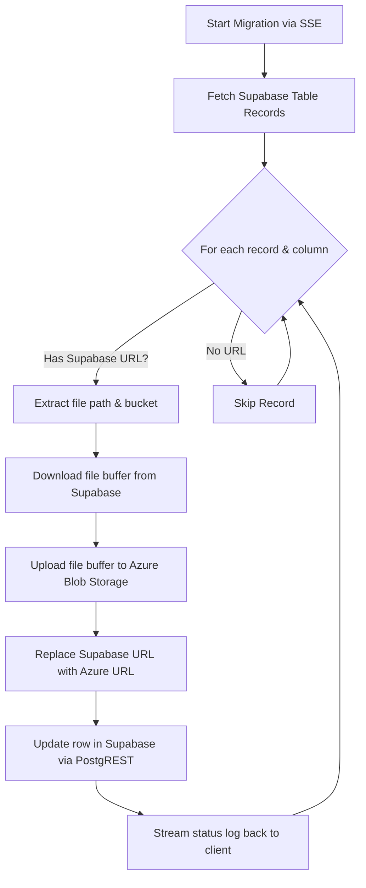

# Integration, Schema Synchronization, and Environment Security Audit Report

## 1. Executive Summary

This report presents a comprehensive, deep-dive integration and security audit of the **Portal Management System**, analyzing the React frontend, Express backend, Supabase PostgreSQL database, local SQLite database, and Azure Blob Storage integrations. 

Our audit has revealed critical, high-risk security vulnerabilities—including a complete bypass of the database **Row-Level Security (RLS)** model due to backdoor policies in Supabase, an **unauthenticated open mail relay** in the Express server, and exposed high-privilege SAS upload generation. Additionally, we identified several schema misalignments between the codebase types, migrations, and the live database state, along with substantial redundant/dead code and database files.

This document details these findings, assesses their impact, and provides a clear, actionable remediation plan to secure the system and align its architecture with enterprise best practices.

---

## 2. Network and API Endpoints Audit

The application uses a hybrid architecture: the frontend React application communicates directly with Supabase for standard CRUD operations, while proxying specific high-privilege or external integrations through a local Express backend running on port `3000`.

### 2.1. Express Server Integration and Endpoints
In development, the Express server (`server.ts`) integrates the Vite dev server as middleware (`vite.middlewares`), meaning both the frontend and backend share port `3000`. In production, Express serves the pre-built static files from the `dist` folder. 

The frontend communicates with three primary server endpoints using standard `fetch` operations:
1.  **`/api/send-email`**: Used to orchestrate Microsoft Graph API email notifications (via [outlookService.ts](file:///c:/Users/onunez/OneDrive%20-%20MT%20INDUSTRIAL%20S.A.C/Escritorio/ProyectosNoCodeCreator/portal_management/src/services/outlookService.ts)).
2.  **`/api/azure-sas-upload`**: Used to generate short-lived Azure Shared Access Signature (SAS) tokens to upload files directly from the browser to Azure Blob Storage (via [SupabaseService.ts](file:///c:/Users/onunez/OneDrive%20-%20MT%20INDUSTRIAL%20S.A.C/Escritorio/ProyectosNoCodeCreator/portal_management/src/lib/SupabaseService.ts)).
3.  **`/api/azure-migrate`**: A Server-Sent Events (SSE) endpoint to run the data and file migration script (via [azureMigrationHelper.ts](file:///c:/Users/onunez/OneDrive%20-%20MT%20INDUSTRIAL%20S.A.C/Escritorio/ProyectosNoCodeCreator/portal_management/src/lib/azureMigrationHelper.ts)).

### 2.2. Critical Vulnerability: Open Server-Side Endpoints
An audit of `server.ts` reveals a total absence of authentication or authorization middleware on these three high-privilege endpoints:
*   **Unauthenticated Open Mail Relay (`/api/send-email`)**: Any client capable of hitting the Express server can POST arbitrary payloads to this endpoint. The server will request an OAuth access token from Microsoft Entra ID and send an email from the official account `RyD_GrupoSole@sole.com.pe` with arbitrary content, subjects, and attachments to any recipient. This represents a severe **Open Mail Relay vulnerability**, which can be abused for phishing, spam distribution, or data exfiltration.
*   **Open SAS URL Generator (`/api/azure-sas-upload`)**: Any client can POST a `fileName` and `fileType` and receive a valid SAS URL with Create and Write permissions (`cw`) to the `industrial-plm` Azure storage container. This allows malicious actors to upload arbitrary files (including malware) directly to company-owned cloud storage, incurring costs and storage bloat.
*   **Triggerable Migration SSE (`/api/azure-migrate`)**: The SSE endpoint is completely open. Anyone can trigger the full Supabase-to-Azure file migration process, creating massive server load, excessive network bandwidth usage, and high API consumption.
*   **Binds to `0.0.0.0`**: The server binds to `0.0.0.0` (all network interfaces):
    ```typescript
    app.listen(PORT, "0.0.0.0", () => { ... });
    ```
    If the host machine is exposed directly to the local network or the internet without strict firewall controls, these unauthenticated endpoints are publicly reachable.

---

## 3. Database Schema Alignment Audit

We cross-referenced the TypeScript definitions in [types.ts](file:///c:/Users/onunez/OneDrive%20-%20MT%20INDUSTRIAL%20S.A.C/Escritorio%20-%20Copy/ProyectosNoCodeCreator/portal_management/src/types.ts) and mappers in [mappings.ts](file:///c:/Users/onunez/OneDrive%20-%20MT%20INDUSTRIAL%20S.A.C/Escritorio%20-%20Copy/ProyectosNoCodeCreator/portal_management/src/lib/mappings.ts) with the live schema on the Supabase PostgreSQL database and the local SQLite database (`records.db`).

### 3.1. Supabase PostgreSQL Schema Mismatches
1.  **`sample_id` Conversion Failure in `product_management`**:
    *   **The Intent**: Migration `20260506222000_fix_pm_samples_relationship.sql` attempted to convert `sample_id` from `text` to `uuid` and add a foreign key constraint linking it to `public.samples(id)`.
    *   **The Reality**: The live table shows that `sample_id` in `public.product_management` remains a **`text`** field and has **no foreign key constraint**!
    *   **The Cause**: The migration wrapped the DDL in a try/catch DO block which silently caught an exception:
        ```sql
        ALTER COLUMN sample_id TYPE uuid USING sample_id::uuid;
        EXCEPTION WHEN others THEN
            RAISE NOTICE 'Could not convert sample_id to UUID...';
        ```
        The conversion failed because existing records in `product_management` contain non-UUID sample identifiers or invalid strings that could not be cast to `uuid`.
    *   **The Consequence**: The database is out of sync with the codebase expectations. Furthermore, the mapper `mapPMRecordToDB` in `mappings.ts` forces `sample_id` to be a valid UUID or sets it to `null`:
        ```typescript
        if (record.sampleId !== undefined) dbRecord.sample_id = isUUID(record.sampleId) ? record.sampleId : null;
        ```
        This means any legacy non-UUID text values in the database will be overwritten with `null` if the record is saved from the frontend.

2.  **`sample_id` Type Mismatch in `energy_efficiency_records`**:
    *   Similar to `product_management`, the column `sample_id` in `public.energy_efficiency_records` is stored as **`text`** with no foreign key, whereas the mapper `mapEEToDB` enforces UUID formatting.

### 3.2. Local SQLite (`records.db`) vs. Supabase Mismatches
1.  **Canton Fair Lat/Lng Coordinates**:
    *   **SQLite**: The table `canton_fair_suppliers` uses `lat` (REAL) and `lng` (REAL).
    *   **Supabase**: The table `public.canton_fair_suppliers` uses `latitude` (numeric) and `longitude` (numeric).
    *   **Frontend Mappers**: The frontend API wrapper in [api.ts](file:///c:/Users/onunez/OneDrive%20-%20MT%20INDUSTRIAL%20S.A.C/Escritorio%20-%20Copy/ProyectosNoCodeCreator/portal_management/src/lib/api.ts) translates `lat` and `lng` to `latitude` and `longitude` during Supabase operations:
        ```typescript
        latitude: supplierData.lat,
        longitude: supplierData.lng
        ```
        However, the backend Express routes for SQLite insert `lat` and `lng` directly. If the backend is ever mixed with Supabase-format objects, coordinates will fail to map.

### 3.3. Redundant / Dead Code and Files
The frontend application was migrated to read and write directly to Supabase for all primary modules, including Canton Fair and Calculation Records. However, the local Express server still maintains a local SQLite database (`records.db`) and defines the following endpoints:
*   `POST /api/records` & `GET /api/records`
*   `POST /api/canton-fair` & `GET /api/canton-fair`
*   `PUT /api/canton-fair/:id` & `DELETE /api/canton-fair/:id`
*   `GET /api/canton-fair/settings/:year` & `POST /api/canton-fair/settings`

**Grep search confirms that the frontend never calls these Express SQLite endpoints.** They are completely dead. Keeping this dead code introduces:
1.  **Extra Dependencies**: Requires the `better-sqlite3` native package, which can cause compile/node-gyp issues across different OS environments.
2.  **Architectural Confusion**: Developers might mistake the SQLite database as the source of truth, when in reality Supabase is used.

---

## 4. Azure Blob Storage Configuration and SSE Migration

We audited [azureMigrationHelper.ts](file:///c:/Users/onunez/OneDrive%20-%20MT%20INDUSTRIAL%20S.A.C/Escritorio%20-%20Copy/ProyectosNoCodeCreator/portal_management/src/lib/azureMigrationHelper.ts) and the SSE `/api/azure-migrate` migration orchestrator in `server.ts`.



### 4.1. Migration Logic Audit
*   **Regex Extraction**: The migration utility uses a global regex to scan text or JSONB values and extract Supabase public storage URLs:
    ```typescript
    const regex = /https:\/\/[a-zA-Z0-9-]+\.supabase\.co\/storage\/v1\/object\/public\/([a-zA-Z0-9-_]+)\/([^\s"'}?,;)]+)/gi;
    ```
    This regex is highly effective and universally matches Supabase storage links embedded inside JSON structures or text columns.
*   **Direct Upload**: It downloads the file into memory as an ArrayBuffer (`Buffer.from(arrayBuffer)`) and uploads it to Azure using the official `@azure/storage-blob` SDK.
*   **In-Place Update**: It replaces the URL inside the text or JSON and performs a standard Supabase client `.update()` query, replacing only the migrated columns.

### 4.2. Risks and Observations
1.  **In-Memory Buffer Load**: Large files are downloaded completely into server RAM before being uploaded. While acceptable for a one-time migration, migrating many large files concurrently could trigger Node.js Out-Of-Memory (OOM) crashes.
2.  **No Rate Limiting / Sleep**: The migration loops through rows and files sequentially with no delay. This can trigger rate limits or abuse flags on either Supabase Storage or Azure Blob Storage during massive migrations.
3.  **State Loss on Disconnect**: If the SSE connection drops or the server restarts mid-migration, there is no progress state preservation. The script will scan all tables again from the beginning. (However, because it only acts on rows matching the Supabase URL regex, it will skip already-migrated rows, making it naturally idempotent. This is a very good design detail).

---

## 5. Environment Variables Audit

The application manages environment variables using Vite's built-in mechanisms and the `dotenv` package in Node.js.

### 5.1. File Security Analysis
*   **.gitignore Alignment**: The `.gitignore` file correctly lists `.env*` and excludes `.env.example`. This ensures that `.env` files containing secrets are never pushed to the repository.
*   **.env.example Completeness**: The current `.env.example` in the root **only** lists `GEMINI_API_KEY` and `APP_URL`. It fails to document the other critical variables required to run the application (Supabase keys, Azure credentials, email secrets).

### 5.2. Exposure and Secret Isolation
We audited the live `.env` variables and their loading:
*   **Vite Public Variables**: `VITE_SUPABASE_URL` and `VITE_SUPABASE_ANON_KEY` are loaded in the frontend. This is secure because these keys are designed to be public and are restricted by RLS in Supabase.
*   **Server-Side Secrets**: `AZURE_TENANT_ID`, `AZURE_CLIENT_ID`, `AZURE_CLIENT_SECRET`, `AZURE_MAIL_USER`, and `AZURE_STORAGE_CONNECTION_STRING` are highly sensitive credentials. They are loaded in `server.ts` via `dotenv` and are **not** prefixed with `VITE_`. Therefore, Vite does not bundle them into the client-side code. This maintains correct, secure isolation of backend secrets.

---

## 6. Supabase Database Security & RLS Audit

We executed raw SQL against the `pg_policies` system table in the live Supabase database. The results revealed **critical security vulnerabilities** that completely compromise the application's access control model.

### 6.1. Critical Vulnerability: The RLS Backdoor Policy
While RLS is technically enabled (`rls_enabled = true`) on every table in the database, the live database contains a policy named **`"Permissive authenticated access"`** on almost every single table:
```json
{
  "tablename": "product_management",
  "policyname": "Permissive authenticated access",
  "roles": "{authenticated}",
  "cmd": "ALL",
  "qual": "true",
  "with_check": "true"
}
```
#### Impact:
In PostgreSQL, RLS policies are **permissive by default** and combined using the **`OR`** operator. 
Because `"Permissive authenticated access"` specifies `TO authenticated` and `USING (true) WITH CHECK (true)`, **any logged-in user in the system is granted full bypass permissions to perform any SELECT, INSERT, UPDATE, or DELETE operation on these tables.** 

This completely invalidates the stricter role-based check policies (like `"Allow write for authorized roles"` or `"Allow write for admins"`). A guest user (`invitado`) can easily write to or delete records from `product_management`, `samples`, `rd_inventory`, etc. 

### 6.2. Anonymous Read Policies on Sensitive Tables
Several policies permit read access to the `public` role (which includes unauthenticated/anonymous users):
*   **`audit_logs`**: `"Allow public read access" ON public.audit_logs TO public USING (true)`
    *   **Risk**: Anyone on the internet can read the complete audit log of the application, including full JSON history of previous and new values, exposing business operations and structural data.
*   **`brand_documents`**: `"Enable read access for all users" ON public.brand_documents TO public USING (true)`
    *   **Risk**: Anyone can read sensitive company design brand files, corporate guidelines, or internal documentation.
*   **`profiles`**: `"Allow reading admin emails for system" ON public.profiles TO public USING ((role = 'admin') AND (is_active = true))`
    *   **Risk**: Allows anyone on the internet to list all administrator emails, facilitating phishing or brute-force targeting.

### 6.3. Architectural Cause: Anon Client backend
The backend Express server does not use a high-privilege `service_role` key. Instead, it initializes the Supabase client using the client-side anonymous key (`VITE_SUPABASE_ANON_KEY`):
```typescript
const supabase = createClient(supabaseUrl, supabaseKey); // uses anon key
```
Because the Express backend queries Supabase as an anonymous (or public) user, the developers were forced to create loose, public read/write RLS policies on Supabase tables so that backend queries wouldn't fail. This represents a fundamental architectural flaw that directly caused these loose policies.

---

## 7. Actionable Recommendations and Remediation Plan

We recommend a staged remediation plan, categorized by risk level.

### Phase 1: Critical Security Remediations (Immediate Action)

#### 1. Implement Token-Based Authentication on Express Endpoints
Add a simple API token or JWT verification middleware in `server.ts` to secure the backend routes:
```typescript
// Define a simple header-based token authentication
const authenticateAPI = (req: express.Request, res: express.Response, next: express.NextFunction) => {
  const authHeader = req.headers.authorization;
  const token = authHeader && authHeader.split(' ')[1];
  
  if (!token || token !== process.env.INTERNAL_API_SECRET) {
    return res.status(401).json({ error: "Unauthorized access to system APIs" });
  }
  next();
};

app.post("/api/send-email", authenticateAPI, async (req, res) => { ... });
app.post("/api/azure-sas-upload", authenticateAPI, async (req, res) => { ... });
app.get("/api/azure-migrate", authenticateAPI, async (req, res) => { ... });
```
Generate a secure secret key, add it to `.env` as `INTERNAL_API_SECRET`, and configure the frontend to send this secret in the headers when fetching these routes.

#### 2. Remove the Backdoor `"Permissive authenticated access"` Policies
Execute a SQL script in the Supabase SQL Editor to drop the wildcard permissive policies that are bypassing RLS.
```sql
-- Example to secure product_management
DROP POLICY IF EXISTS "Permissive authenticated access" ON public.product_management;
DROP POLICY IF EXISTS "Permissive authenticated access" ON public.samples;
DROP POLICY IF EXISTS "Permissive authenticated access" ON public.products;
DROP POLICY IF EXISTS "Permissive authenticated access" ON public.rd_inventory;
-- Repeat for all tables listed in the audit report
```

#### 3. Restrict Public SELECT Policies to Authenticated Users
Convert open public policies on sensitive tables (like `audit_logs`, `brand_documents`) to `authenticated` users only:
```sql
DROP POLICY IF EXISTS "Allow public read access" ON public.audit_logs;
CREATE POLICY "Allow authenticated read" ON public.audit_logs 
  FOR SELECT TO authenticated USING (true);
```

#### 4. Configure Express Server to Use `service_role` Key
Define a `SUPABASE_SERVICE_ROLE_KEY` variable in the `.env` file on the server. Initialize the Supabase client inside `server.ts` using this key instead of the anonymous key:
```typescript
const supabaseServiceKey = process.env.SUPABASE_SERVICE_ROLE_KEY || "";
const supabase = createClient(supabaseUrl, supabaseServiceKey); // Server operates as superuser
```
This enables the backend to query any database tables freely (bypassing RLS safely on the server side), allowing you to restrict frontend RLS policies to authenticated users without breaking backend mail/audit flows.

---

### Phase 2: Schema Realignment & Code Cleanup

#### 1. Complete `sample_id` UUID Mismatches
Perform a data cleanup on Supabase `product_management` and `energy_efficiency_records` tables to identify and fix any invalid non-UUID strings in the `sample_id` column. Once clean, execute the migration to convert the columns to `uuid` and establish foreign key constraints.
```sql
-- Clean up invalid texts (set them to null or map them to actual sample UUIDs first)
UPDATE public.product_management 
SET sample_id = NULL 
WHERE sample_id IS NOT NULL AND sample_id !~ '^[0-9a-f]{8}-[0-9a-f]{4}-[0-9a-f]{4}-[0-9a-f]{4}-[0-9a-f]{12}$';

-- Alter table structure
ALTER TABLE public.product_management 
ALTER COLUMN sample_id TYPE uuid USING sample_id::uuid;

ALTER TABLE public.product_management
ADD CONSTRAINT product_management_sample_id_fkey 
FOREIGN KEY (sample_id) REFERENCES public.samples(id) ON DELETE SET NULL;
```

#### 2. Remove Dead SQLite Code and SQLite Database
Since the frontend operates completely on Supabase:
*   Remove the `better-sqlite3` import and initialization from `server.ts`.
*   Delete the unused SQLite endpoints (`/api/records`, `/api/canton-fair`, etc.).
*   Delete the `records.db` database file from the repository.
*   Uninstall `better-sqlite3` from `package.json` to eliminate native build dependencies.

#### 3. Document all `.env` Variables
Update `.env.example` in the root folder to completely document all variables, helping future developers configure their environment safely:
```bash
# Supabase Keys (Public)
VITE_SUPABASE_URL="https://your-project.supabase.co"
VITE_SUPABASE_ANON_KEY="eyJhbGciOi..."

# Azure AD Credentials for Email (Server-Only Secrets)
AZURE_TENANT_ID="your-tenant-uuid"
AZURE_CLIENT_ID="your-client-uuid"
AZURE_CLIENT_SECRET="your-client-secret"
AZURE_MAIL_USER="RyD_GrupoSole@sole.com.pe"

# Azure Blob Storage (Server-Only Secrets)
AZURE_STORAGE_CONNECTION_STRING="DefaultEndpointsProtocol=https;AccountName=..."
AZURE_STORAGE_CONTAINER="industrial-plm"

# Internal Server Secret
INTERNAL_API_SECRET="generate-a-secure-random-token"
```

---

### Phase 3: Azure Migration Optimizations

#### 1. Add Stream-Based Uploads and Batching
To protect against server OOM errors during migration, replace buffer downloads with chunked stream uploads using Azure Storage SDK's `uploadStream` method:
```typescript
import { Readable } from 'stream';

// Instead of arrayBuffer:
const response = await fetch(item.fullUrl);
const stream = Readable.fromWeb(response.body as any);

const blockBlobClient = containerClient.getBlockBlobClient(azurePath);
await blockBlobClient.uploadStream(stream, undefined, undefined, {
  blobHTTPHeaders: { blobContentType: response.headers.get("content-type") || undefined }
});
```

#### 2. Introduce Throttle / Sleep
In `azureMigrationHelper.ts`, add a small sleep buffer (e.g., 100-200ms) inside the loop after each file processing step to prevent hitting API rate limits:
```typescript
const sleep = (ms: number) => new Promise(resolve => setTimeout(resolve, ms));
// inside loop
await sleep(150);
```
